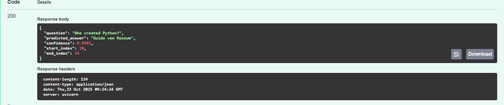

# 🧠 BERT Question Answering (Extractive QA with FastAPI + MLflow)




---

## 📘 Overview

This project implements an **Extractive Question Answering (QA)** system using a fine-tuned **DistilBERT** model on the **SQuAD** dataset.  
It can answer questions based on a given context paragraph, deployed through a **FastAPI** web service and tracked using **MLflow** for experiment logging.

**Example:**

> **Question:** Who created Python?
>   
> **Context:** Python was created by Guido van Rossum in 1991.
>   
> **Answer:** Guido van Rossum ✅

---

## ⚙️ Tech Stack

| Category | Tool / Library |
|-----------|----------------|
| Model | `distilbert-base-cased-distilled-squad` |
| Framework | PyTorch, Hugging Face Transformers |
| API | FastAPI + Uvicorn |
| Experiment Tracking | MLflow |
| Visualization | Pandas Token Table |
| Language | Python 3.10 |
| Environment | Local CPU |

---

## 🧩 Features

- 🧠 **BERT-based Extractive QA** → Finds exact text spans that answer questions  
- ⚙️ **FastAPI endpoint** → Interactive `/predict` API  
- 📊 **MLflow integration** → Logs question, answer, confidence, and model version  
- 🧾 **Batch evaluation** → Log multiple QA pairs in a single script  
- 🖼️ **Token visualization** → See start/end logits and confidence scores  
- 🚀 **Swagger UI** → Easy question testing at `/docs`

---

## 🧮 Example Output

>Question: Who created Python?
>
>Predicted Answer: Guido van Rossum
>
>Confidence: 0.982
>
>Start Index: 10
>
>End Index: 14

---

## 🚀 Run Locally

### 🧰 1. Clone the repository

```bash
git clone https://github.com/rakshaanagendra/BERT_QA.git
cd BERT_QA
```

### ⚙️ 2. Create virtual environment

```bash
python -m venv venv
.\venv\Scripts\activate
```

### 📦 3. Install dependencies
```bash
pip install -r requirements.txt
```

### ▶️ 4. Run the FastAPI server

```bash
uvicorn app.main:app --reload
Then open your browser → http://127.0.0.1:8000/docs
```
### 🧠 Example API Request
{
  "question": "Who created Python?",
  "context": "Python was created by Guido van Rossum in 1991."
}
### Response
{
  "question": "Who created Python?",
  "predicted_answer": "Guido van Rossum",
  "confidence": 0.982
}

---

## 📊 MLflow Experiment Tracking
```bash
mlflow ui
Open http://127.0.0.1:5000
```

You’ll see:
- Parameters → model, question, context length
- Metrics → confidence, start/end indices
- Artifacts → predicted answer text files

--- 


